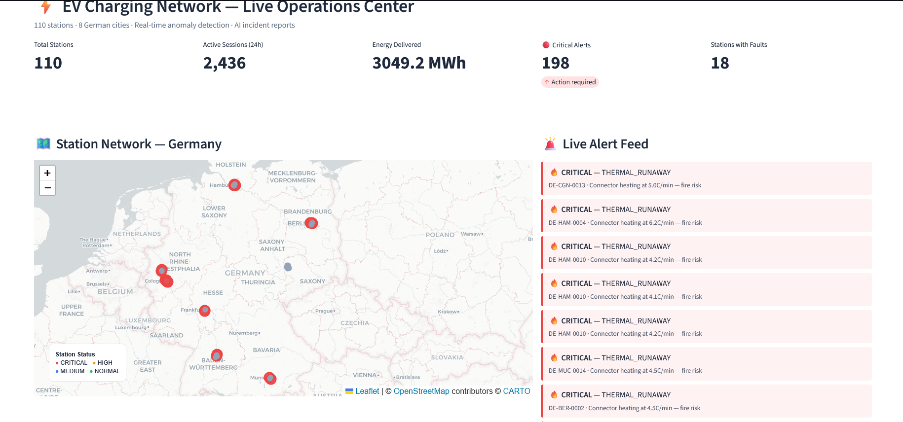
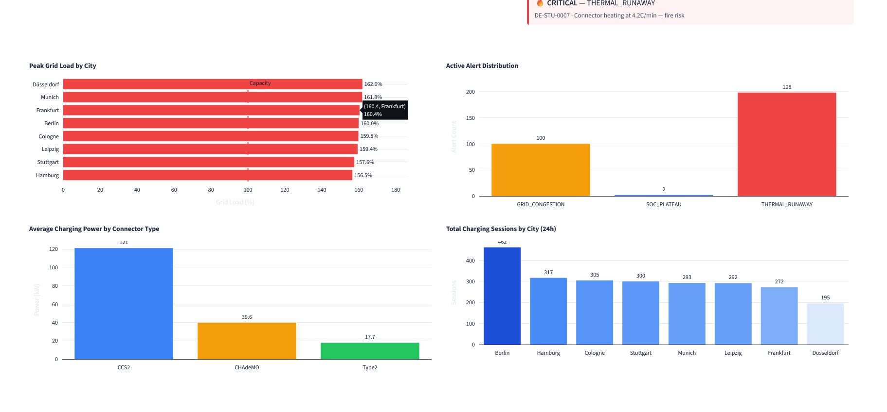
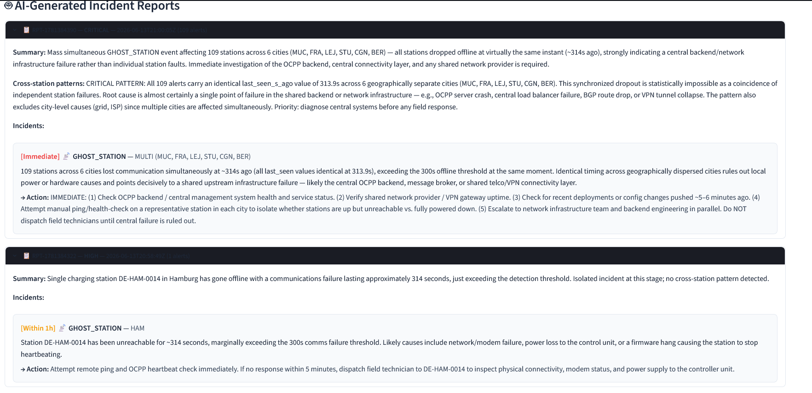
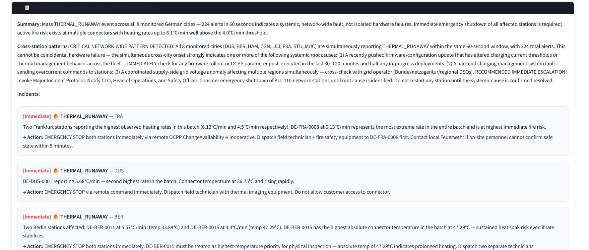

# EV Charging Network — Agentic Stream Intelligence

Real-time anomaly detection and AI-powered incident reporting for a simulated national EV charging network. 110 stations across 8 German cities stream telemetry via Kafka through a 3-agent pipeline — detecting faults, correlating cross-station patterns, and generating actionable maintenance reports via Claude AI.

---

## Dashboard


*KPI row (110 stations, 2,436 sessions, 3,049 MWh, 198 critical alerts) + Germany map with severity-colored stations + live alert feed*


*Peak grid load by city (all cities >150% capacity), active alert distribution, connector power by type, charging sessions by city*


*Claude detects 109 simultaneous ghost stations across 6 cities — correctly identifies shared infrastructure failure, recommends OCPP backend check before field dispatch*


*Claude identifies network-wide thermal runaway across all 8 cities — invokes Major Incident Protocol, recommends emergency shutdown of all 110 stations*

---

## Architecture

```
┌─────────────────────────────────────────────────────────┐
│  station_simulator.py                                    │
│  110 stations · 8 German cities · 24h · 1-min resolution│
│  CC-CV charging curves · time-of-day demand profiles     │
└──────────────────────────┬──────────────────────────────┘
                           │ 158K rows/day
                           ▼
┌─────────────────────────────────────────────────────────┐
│  fault_injector.py                                       │
│  6 fault types · ground-truth labels · 12 events/day    │
└──────────────────────────┬──────────────────────────────┘
                           │ telemetry_faulted.csv
                           ▼
┌─────────────────────────────────────────────────────────┐
│  producer.py → Kafka Topic: ev.telemetry.raw             │
│  Configurable replay speed (--speed 60 = live mode)      │
└──────┬───────────────────────────────────────────────────┘
       │
       ▼
┌─────────────────┐    ┌──────────────────┐    ┌──────────────────┐
│  stream_agent   │    │  anomaly_agent   │    │  report_agent    │
│                 │    │                  │    │                  │
│ 10-min rolling  │───▶│ 6 fault detectors│───▶│ Claude API       │
│ window per      │    │ rate-of-change   │    │ 60s batch window │
│ station         │    │ cross-station    │    │ structured JSON  │
│                 │    │ dedup by city    │    │ reports          │
└────────┬────────┘    └────────┬─────────┘    └────────┬─────────┘
         │                      │                        │
         ▼                      ▼                        ▼
  ev.telemetry.windowed     ev.alerts              ev.reports
                                                  data/reports/*.json
                                                        │
                                                        ▼
                                              ┌──────────────────────┐
                                              │  Streamlit Dashboard  │
                                              │  folium map · charts  │
                                              │  alert feed · reports │
                                              └──────────────────────┘
```

---

## Fault Scenarios

| Fault Type | Severity | Detection Method | Cities |
|---|---|---|---|
| THERMAL_RUNAWAY | CRITICAL | temp rate-of-change >5.5°C/min | Berlin, Munich |
| GRID_CONGESTION | HIGH | grid_load_pct >115% sustained | Berlin, Munich |
| GHOST_STATION | HIGH | heartbeat absence >10 min | Frankfurt, Hamburg |
| PHANTOM_SESSION | MEDIUM | CHARGING status + power <0.5kW | Hamburg, Cologne |
| SOC_PLATEAU | MEDIUM | SoC delta <0.3% over 10 min | Frankfurt, Stuttgart |
| FIRMWARE_FAULT | LOW | E042 correlated across 2.3.0 cluster | Leipzig, Düsseldorf |

**Key design:** FIRMWARE_FAULT is only detectable cross-station — a single E042 looks like noise; the city-wide cluster at a specific hour reveals the pattern. GHOST_STATION detection works by *absence* — missing heartbeats, not a fault code.

---

## Agent Design

### stream_agent.py
Consumes `ev.telemetry.raw`, maintains per-station rolling 10-minute windows (deque), computes rolling stats (temp rate-of-change, power variance, SoC delta, grid load aggregates), publishes enriched records to `ev.telemetry.windowed`.

### anomaly_agent.py
Consumes `ev.telemetry.windowed`, applies 6 detection rules. Alert deduplication keyed by **city** (not station) — prevents alert storms when multiple stations in same city trigger simultaneously. Ghost station detection runs on a 60-second real-time heartbeat check independent of Kafka message flow.

### report_agent.py
Batches alerts over 60-second windows, calls Claude API (`claude-sonnet-4-6`) with a structured ops-analyst system prompt. Reports include:
- Executive summary
- Per-fault-type incident breakdown with urgency classification
- Cross-station pattern analysis (critical for firmware faults and simultaneous ghost events)
- OCPP-aware action recommendations (ChangeAvailability, heartbeat checks, field dispatch decisions)

**Sample AI output:**
> *"109 stations across 6 cities lost communication simultaneously — identical last_seen timing across geographically dispersed cities rules out local power causes and points to shared upstream infrastructure failure (OCPP backend, message broker, or VPN gateway). Do NOT dispatch field technicians until central failure is ruled out."*

---

## Station Network

| City | Code | Stations | Connector Mix |
|---|---|---|---|
| Berlin | BER | 18 | CCS2, Type2, CHAdeMO |
| Munich | MUC | 16 | CCS2, Type2, CHAdeMO |
| Hamburg | HAM | 15 | CCS2, Type2, CHAdeMO |
| Frankfurt | FRA | 14 | CCS2, Type2, CHAdeMO |
| Cologne | CGN | 13 | CCS2, Type2, CHAdeMO |
| Stuttgart | STU | 12 | CCS2, Type2, CHAdeMO |
| Düsseldorf | DUS | 11 | CCS2, Type2, CHAdeMO |
| Leipzig | LEJ | 11 | CCS2, Type2, CHAdeMO |

Connector distribution: 50% CCS2 (150kW), 35% Type2 (22kW AC), 15% CHAdeMO (50kW). 25% of stations on firmware 2.3.0 (fault-injection target).

---

## Running the Project

### Prerequisites
- Python 3.11+
- Docker Desktop
- Anthropic API key

### Setup

```bash
git clone https://github.com/yourusername/ev-charging-agentic-intelligence
cd ev-charging-agentic-intelligence

python -m venv venv
source venv/bin/activate      # Windows: venv\Scripts\Activate.ps1
pip install -r requirements.txt

# Add your API key
echo "ANTHROPIC_API_KEY=sk-ant-..." > .env
```

### Generate Data

```bash
python src/station_simulator.py   # → data/telemetry_raw.csv (158K rows)
python src/fault_injector.py      # → data/telemetry_faulted.csv
```

### Start Kafka

```bash
docker compose up -d
# Wait 15 seconds for Kafka to initialize
docker ps   # verify ev_kafka and ev_zookeeper are Up
```

### Run Everything (Docker — single command)

```bash
docker compose up --build
# Open http://localhost:8501
```

All 7 services start automatically in the correct order:
Zookeeper → Kafka → Producer → Stream Agent → Anomaly Agent → Report Agent → Dashboard

### Run Locally (development)

```bash
# Generate data first (one-time)
python src/station_simulator.py
python src/fault_injector.py

# Start Kafka only
docker compose up -d zookeeper kafka

# Then 4 terminals:
python src/producer.py --speed 60
python src/stream_agent.py
python src/anomaly_agent.py
python src/report_agent.py

# Dashboard
streamlit run dashboard.py
```

---

## Project Structure

```
ev-charging-agentic-intelligence/
├── src/
│   ├── stations.py              # Station registry (110 stations, 8 cities)
│   ├── station_simulator.py     # 24h telemetry simulation (CC-CV curves)
│   ├── fault_injector.py        # 6 fault scenarios + ground-truth labels
│   ├── producer.py              # Kafka producer (configurable replay speed)
│   ├── stream_agent.py          # Rolling window enrichment agent
│   ├── anomaly_agent.py         # Multi-fault detection agent
│   └── report_agent.py          # Claude API report generation agent
├── data/
│   ├── stations.csv             # Station registry (gitignored)
│   ├── telemetry_raw.csv        # Clean baseline (gitignored)
│   ├── telemetry_faulted.csv    # Faulted dataset (gitignored)
│   └── reports/                 # AI-generated JSON reports (gitignored)
├── outputs/
│   ├── dashboard_overview.png
│   ├── dashboard_map_alerts.png
│   ├── dashboard_charts.png
│   └── dashboard_reports.png
├── notebooks/
│   └── analysis.ipynb           # Optional: fault pattern analysis
├── dashboard.py                 # Streamlit dashboard
├── docker-compose.yml           # Kafka + Zookeeper
├── requirements.txt
├── .env.example
├── .gitignore
└── README.md
```

---

## Tech Stack

| Layer | Technology |
|---|---|
| Streaming | Apache Kafka (Confluent 7.6, Docker) |
| Agents | Python, confluent-kafka |
| AI Reports | Anthropic Claude API (claude-sonnet-4-6) |
| Dashboard | Streamlit, Plotly, Folium |
| Data | pandas, numpy |
| Infrastructure | Docker Compose |

---
